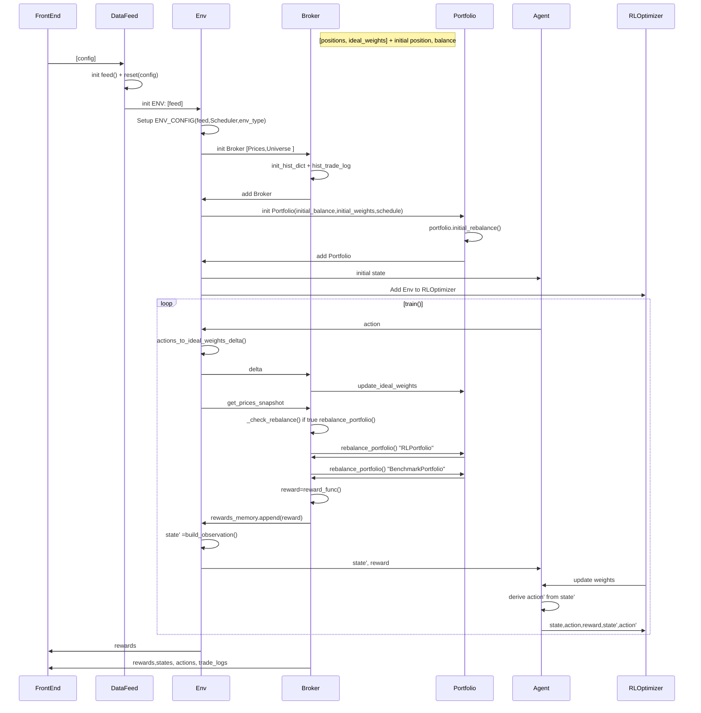

# Reinforcement Learning for Factor Investing - Environment Description


## Data Feed Class 

The **Data Feed** class implements all the **data fetching** and **pre-processing** logic of the Reinforcement Learning (RL) environment. It directly fetches the data from the data storage at every environment step. Previously the data was already cleaned and pre-processed in order to build observations in a set format that can be processed by the Agent (usually a neural network).  

**reset()**:  This function is called first at the start of every experiment. The function itself pulls the instrument data from the csv file and stores them into a dict with the \_convert_to_dict function in the data variable.

## Portfolio Class

The **Portfolio Class** stores all the relevant information of each of the portfolios involved in the the simulation.  

Portfolios have two key attributes:  

-   **positions:** Dictionary whose keys are the names of the assets a Portfolio holds and whose values represent the amount of units of each asset. 
-   **ideal_weights:** Dictionary whose keys are the names of the assets a Portfolio holds and whose values represent the % weight it should aim to hold in the respective asset after the next rebalance.

The class’ Init function has the following arguments:

```bash
initial_balance (dict): Initial holdings of the portfolio, in units of cash.  
investment_universe (list): List of string names of all the assets the portfolio can hold positions in.  
restrictions (list): list of boolean methods to apply to self.ideal_weights when rebalancing.  
start_date (Datetime): Starting date of the portfolio.  
schedule (func): Boolean function that specifies whether or not a portfolio should be rebalanced at a given date.  
initial_positions (str): Type of initial portfolio configuration (equally weighted, no initial positions etc.)  
rebalancing_type (str): Type of rebalancing to be carried out on the portfolio (equally weighted,  
performance based, volatility based etc.)
```

**Schedules** are used by the broker to know when a Portfolio should be rebalanced according to its ideal_weights (which is the attribute modified by the Agent via its actions). In addition to this, over the course of the simulation the Portfolio objects store the state of individual portfolios i.e. their positions and cash available. 

The **initial_balance**, **investment_universe**, and **initial_positions** store the initial units of currency the Portfolio starts with, the assets it is allowed to hold and the initial positions it should aim for in its first rebalance. 

The **rebalancing_type** indicates how a benchmark’s portfolio **ideal_weights** should evolve  over time, possibly due to market phenomena (The corresponding logic to adjust the **ideal_weights**  needs to be implemented in the Broker). 

Additionally, it implements the following methods:  

**\_initial_rebalance():** calculates the initial positions of the Portfolio in # of shares according to the initial_positions parameter. I.e. if initial_positions = ‘equally_weighted’ then **initial_rebalance** aims to achieve an equally weighted position across all assets of the investment universe. 

**\_check_rebalance():** checks if a portfolio needs to be rebalanced according to its schedule on a given date. 

**reset():** sets the positions to the initial positions (Assets + cash account), triggers then the initial_rebalance and sets the startdate and the trade_idx to 0.

## Broker Class

The Broker class implements the following methods: 

**update_ideal_weights():** Updates a portfolio’s ideal_weights given a weights delta (a dict containing the change in the value on the ideal_weights dict of each asset). This function is called both to update the RL portfolio’s ideal_weights according to the Agent’s actions and to update all benchmark portfolios’ ideal_weights according to their rebalancing_type. 

**rebalance_portfolio():** Checks whether a Portfolio should be rebalanced or not according to its schedule and if so, calculates the % difference between the portfolio’s ideal_weights and actual weights (obtained from the positions).  

This % difference is translated into trades by first calculating the total capital each % represents (by multiplying it with the Portofolio’s total value) and then discretizing it into integer trades (we do not allow for fractional shares) by dividing by the current price of the assets at hand.  

The previous calculations yield a series of rebalancing trades that we execute as follows:  

-   We first carry out the selling transactions, adding the resulting capital to the Portfolio’s cash position.  
-   We now check If we have enough cash to carry out the buying transactions. If we do we execute them, if we don’t, we have to scale them down (this was the part that gave Kia trouble, I implemented this for a Portfolio with 2 assets, as there is only 1 buy transaction that can be scaled down, but with multiple assets a scale down method is needed) 
-   Finally, after all the transactions are carried out, we may have a lot of leftover cash. If this is not desirable, buying transactions can be attempted to reduce this. 

**\_record_position()s:** Records portfolio attributes, asset prices and trades executed  over time in dictionaries that are later on accessed to calculate rewards. 

If any Portfolio carries a specific logic to modify its ideal_weights (as indicated by its **rebalancing_type**), this should be implemented in the Broker as well. For now, the benchmark Portfolio is equally weighted, so its ideal weights are constant and thus additional logic is not necessary. 

**reset():**  Calls data\_feed.reset() -> assigns the new data feed with start date to the brokers data feed , stores prices and the dates. Further we initiate the benchmark- and RL-Portfolio with attributes (timestamp, positions, ptf_values, ptf_weights, and the ideal\_weights) with empty lists. Moreover we reset the historical asset prices and call the portfolio.reset() with the new prices and dates and store them as dicts. In the last steps the function calculates the portfolio weights and value amount and stores them as well.

## Gym Environment Class

Finally, the Gym Environment class implements the **reset()** and **step()** via the following methods:  

**build_observation():** Makes use of the data_feed in order to fetch an observation to feed to the Agent as an output of the step() function. 

**action_to_ideal_weights_delta():** Translates agent actions into ideal_weights_deltas dicts that are fed to the Broker to modify the RL portfolio.  

**reward_func():** calculates rewards to output in the step() via accessing the information of all relevant portfolios on the Broker’s historical dictionaries and logs.

## Sequence Diagram



